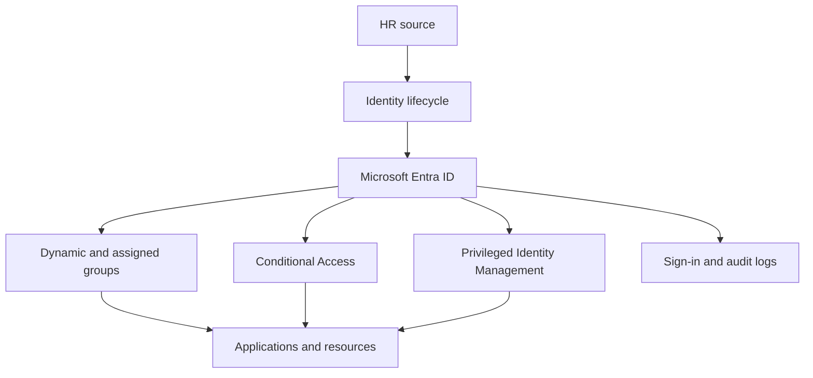

# Microsoft Entra ID Enterprise Implementation

> A portfolio lab demonstrating how I would design, implement, test, and document Microsoft Entra ID for a growing healthcare organization.

**Status:** Architecture and planning  
**Client:** Northstar Telehealth Solutions *(fictional)*  
**Primary roles demonstrated:** Identity Administrator · IAM Consultant · Cybersecurity Consultant · Solutions Engineer

## Executive Summary

Northstar Telehealth Solutions has 250 employees, contractors, privileged administrators, and external partners. Rapid growth created inconsistent onboarding, excessive access, limited privileged-role oversight, and uneven multifactor authentication adoption.

This project designs a secure Microsoft Entra ID implementation that centralizes identity, applies least privilege, standardizes the user lifecycle, and introduces risk-aware access controls without creating unnecessary friction.

## Business Requirements

- Centralize workforce and guest identities
- Standardize joiner, mover, and leaver processes
- Require strong authentication for sensitive access
- Reduce standing administrative privilege
- Support secure remote work and partner collaboration
- Produce auditable access and role-assignment records
- Deploy controls gradually with pilot groups and rollback plans

## Target Architecture



## Planned Scope

| Workstream | Deliverables |
|---|---|
| Discovery | Requirements questionnaire, persona inventory, current-state risks |
| Identity design | Naming standards, user types, group strategy, administrative units |
| Authentication | MFA registration, authentication methods, SSPR approach |
| Authorization | RBAC model, least-privilege role matrix, separation of duties |
| Conditional Access | Baseline policy set, exclusions, report-only rollout |
| Privileged access | PIM design, eligible assignments, activation requirements |
| Lifecycle | Joiner-mover-leaver workflow and external-user governance |
| Automation | Microsoft Graph PowerShell scripts and reporting |
| Validation | Test cases, evidence, issue log, rollback criteria |

## Proposed Conditional Access Baseline

| Policy | Target | Control | Initial state |
|---|---|---|---|
| Require MFA for administrators | Directory roles | Strong authentication | Report-only |
| Block legacy authentication | All users | Block access | Report-only |
| Require MFA for users | Workforce users | MFA | Report-only |
| Protect security-info registration | All users | MFA from trusted conditions | Report-only |
| Require compliant devices for sensitive apps | Clinical and finance groups | Compliant device | Report-only |
| Restrict high-risk access | Eligible licensed users | Remediation or block | Design only |

Emergency-access accounts, service dependencies, licensing, and workload identities will be reviewed before enforcement.

## Implementation Approach

1. Discover business, identity, application, and compliance requirements.
2. Establish naming, grouping, role, and account standards.
3. Configure a small pilot population.
4. Introduce authentication registration and SSPR.
5. Deploy Conditional Access in report-only mode.
6. Review sign-in impact and remediate exclusions.
7. Implement privileged-access controls.
8. Expand in controlled waves.
9. Validate outcomes and transfer operational documentation.

## Success Measures

- 100% of pilot users registered for approved authentication methods
- No permanent Global Administrator assignment for routine administration
- Documented owner and purpose for every privileged group
- Conditional Access test cases pass before enforcement
- Joiner and leaver test accounts receive and lose access as designed
- Exportable evidence exists for role, group, sign-in, and policy reviews

## Repository Roadmap

- [ ] Add current-state and target-state diagrams
- [ ] Build persona and access matrices
- [ ] Document tenant and group standards
- [ ] Create Conditional Access policy specifications
- [ ] Add PowerShell/Graph automation
- [ ] Execute pilot test cases
- [ ] Publish sanitized results and lessons learned

## Planned Repository Structure

```text
architecture/       Current-state and target-state designs
discovery/          Requirements, personas, and assumptions
design/             Identity, group, role, and lifecycle decisions
conditional-access/ Policy matrix, deployment, and rollback plans
automation/         Microsoft Graph PowerShell scripts
testing/            Test cases, evidence, and issue tracking
```

## Related Portfolio Projects

- [Intune Secure Endpoint Deployment](https://github.com/sclem34/intune-secure-endpoint-deployment)
- [Zero Trust Access Lab](https://github.com/sclem34/zero-trust-access-lab)
- [Secure Modern Workplace Demo](https://github.com/sclem34/secure-modern-workplace-demo)

## Disclaimer

This is a personal lab using a fictional organization and sanitized data. Features will be marked as **designed**, **simulated**, **implemented**, or **validated** as work progresses. No employer or client information is included.
